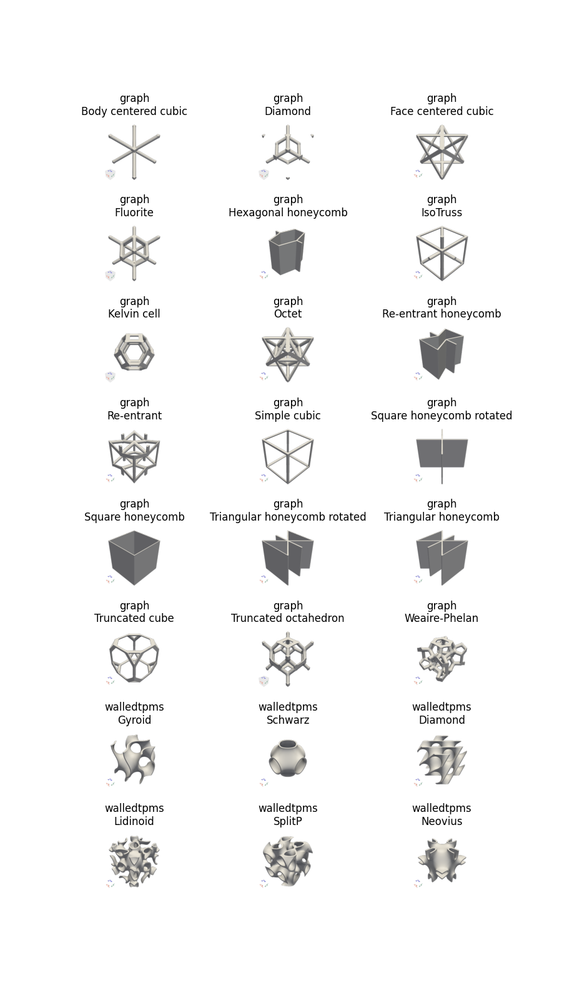

# UnitcellDB
**UnitcellDB** is a submodule of the lattice design tool **UnitcellHub**. 
It contains a database of simulated meso-scale lattice properties (including geometric and structural/thermal performance) for more than 13,000 point designs.
All properties were generated using **UnitcellHub**'s **UnitcellEngine**: for more details regrading geometry definitions, simulation details, etc., see [http://github.jpl.nasa.gov/watkinrt/unitcellengine](http://github.jpl.nasa.gov/watkinrt/unitcellengine).
The **UnitcellDB** database is stored in the open source [HDF5](https://www.hdfgroup.org/solutions/hdf5/) database format within the file *unitcelldb.h5*.
The quickest way to get started viewing the database is with [HDFView](https://www.hdfgroup.org/downloads/hdfview/); however, for more detailed interrogation and interaction, an HDF5 tool like Python's [pytable](https://www.pytables.org/) is required (see [the examples folder](http://github.jpl.nasa.gov/watkinrt/unitcelldb/tree/main/examples) for more details). 

## Database contents
The primary data in **UnitcellDB** are geometric, effective linear elastic mechanical, and effective thermal properties.
Here, "effective" refers to the homogenized, macro-scale properties of a lattice structure and thus are only valid where the length-scale of the lattice unitcell is much smaller than that of the macroscopic structure.
The database was constructed by sampling 18x unitcell types (show below) across a range of geometric variations (aspect ratio and thickness).
In general, the properties are normalized to be length-scale and material agnostic.
The primary exception to this is for the linear elastic mechanical properties, as Poisson's ratio cannot be fully normalized out; thus, a Poisson's ratio is specified.
Currently, all data are with respect to a material with Poisson's ratio of $\nu$=0.3, which is relevant to most metallics and glassy-state polymers.

## Database structure
The **UnitcellDB** database structure consists of a primary data table called *design*.
Each element in the *design* table corresponds to a lattice point design and contains the fields in the below table.
Unless specified otherwise, the property normalization scheme is as follows:
- Geometric distances (such as length and width) have arbitrary scaling. To convert to absolute units, all geometric distances must be multiplied by the same scaling factor. For example, if **length**=5 and **width**=2 and we want a unitcell with length 10 mm, then we multiple all normalized geometric parameters by 2x. So, in this case, for a length of 10 mm, the width is 2*2=4 mm.
- Stiffness-based mechanical properties (elastic and shear modulii) are normalized by the elastic modulus of the base material. For example, if we're interested in aluminum lattices, we can convert the stiffness property **Emin** to absolute units by multiplying it by 68 GPa (the elastic modulus of aluminum). 
- Conductance-based thermal properties are normalized by the thermal conductance of the base material. For example, if we're interested in aluminum lattices, we can convert the conductance property **Kmin** to absolute units by multiplying it by 152 W/mK (the thermal conductance of Aluminum 6061).

| **Field** | Category | Dependence | Description |
|-------|----------|------------|-------------|
| **image** | General  | Derived    | 200x200x4 table of integers corresponding to an rgba image of the lattice unitcell.|
| **date** |  General  | Derived    | Creation date in the form of the vector [year, month, day, hour, minute, second]. |
| **unitcell** | Geometry | Specified | String defining the unitcell name (such as "Body centered cubic", "Octet", or "Gyroid"). |
| **form** | Geometry | Specified | String defining the unitcell type (such as "walledtpms" -- Thin-walled Triply Periodic Minimal Surface -- or "graph" -- unitcells defined by nodal points and beam/plate connections  |
| **length** | Geometry | Specified | Normalized length of the unitcell (distance along the x-direction). |
| **width** | Geometry | Specified | Normalized width of the unitcell (distance along the y-direction). |
| **height** | Geometry | Specified | Normalized height of the unitcell (distance along the z-direction). |
| **thickness** | Geometry | Specified | Normalized thickness of the primary unitcell feature (such as the strut or plate thickness). |
| **radius** | Geometry | Specified | Fillet radius for feature connection points normalized by the **thickness** property. |
| **relativeDensity** | Geometry | Derived | Relative density of the unitcell (volume of material within the unitcell normalized by the total volume of the unitcell bounding box). |
| **relativeSurfaceArea** | Geometry | Derived | Relative surface area of the unitcell (surface of the material within the unitcell normalized by the total surface area of the unitcell bounding box). |
| **youngsModulus** | Material | Specified | Elastic modulus of the base material. This property is redundant, as it has already been incorporated into the normalized properties, but is reported for consistency purposes. |
| **poissonRatio** | Material | Specified | Poisson's ratio of the base material. |
| **conductance** | Material | Specified | Conduction coefficienct of the base lattice material. This property is redundant, as it has already been incorporated into the normalied properties, but is reported for consistency purposes. |
| **homogenizedCompliance** | Mechanical | Derived | A 6x6 table corresponding to the normalized homogenized compliance matrix with respect to tensorial strains (rather than engineering strains). The row/column ordering correspond to ["xx", "yy", "zz", "xy", "yz", "xz"].  |
| **homogenizedStiffness** | Mechanical | Derived |  A 6x6 table corresponding to the normalized homogenized stiffness matrix with respect to tensorial strains (rather than engineering strains). The row/column ordering correspond to ["xx", "yy", "zz", "xy", "yz", "xz"].  |
| **Emin** | Mechanical | Derived | Minimum possible normalized elastic modulus for any possible loading direction. |
| **EminDirection** | Mechanical | Derived | Length 3 vector specifying the loading direction of minimum elastic modulus. |
| **Emax** | Mechanical | Derived | Maximum possible normalized elastic modulus for any possible loading direction. |
| **EmaxDirection** | Mechanical | Derived | Length 3 vector specifying the loading direction of maximum elastic modulus. |
| **Gmin** | Mechanical | Derived | Minimum possible normalized shear modulus for any possible shear plane and loading direction. |
| **GminDirection** | Mechanical | Derived | Length 3 vector specifying the loading direction of minimum shear modulus. |
| **GminNormal** | Mechanical | Derived | Length 3 vector specifying the shear plane normal for minimum shear modulus. |
| **Gmax** | Mechanical | Derived | Maximum possible normalized shear modulus for any possible shear plane and loading direction. |
| **GmaxDirection** | Mechanical | Derived | Length 3 vector specifying the loading direction of maximum shear modulus. |
| **GmaxNormal** | Mechanical | Derived | Length 3 vector specifying the shear plane normal for maximum shear modulus. |
| **numin** | Mechanical | Derived | Minimum possible Poisson's ratio for any possible shear plane and loading direction. |
| **numinDirection** | Mechanical | Derived | Length 3 vector specifying the loading direction of minimum Poisson's ratio. |
| **numinNormal** | Mechanical | Derived | Length 3 vector specifying the shear plane normal for minimum Poisson's ratio.  |
| **numax** | Mechanical | Derived | Maximum possible Poisson's ratio for any possible shear plane and loading direction. |
| **numaxDirection** | Mechanical | Derived | Length 3 vector specifying the loading direction of maximum Poisson's ratio. |
| **numaxNormal** | Mechanical | Derived | Length 3 vector specifying the shear plane normal for maximum Poisson's ratio. |
| **vonMisesWorst11** | Mechanical | Derived | Worst case von Mises stress within the lattice when subjected to a uniaxial unit macroscopic stress $\sigma$xx. |
| **vonMisesWorst22** | Mechanical | Derived | Worst case von Mises stress within the lattice when subjected to a uniaxial unit macroscopic stress $\sigma$yy. |
| **vonMisesWorst33** | Mechanical | Derived | Worst case von Mises stress within the lattice when subjected to a uniaxial unit macroscopic stress $\sigma$zz. |
| **vonMisesWorst12** | Mechanical | Derived | Worst case von Mises stress within the lattice when subjected to a shear unit macroscopic stress $\sigma$xy. |
| **vonMisesWorst23** | Mechanical | Derived | Worst case von Mises stress within the lattice when subjected to a shear unit macroscopic stress $\sigma$yz. |
| **vonMisesWorst33** | Mechanical | Derived | Worst case von Mises stress within the lattice when subjected to a shear unit macroscopic stress $\sigma$xz. |
| **vonMisesWorst** | Mechanical | Derived | Worst case local von Mises stress when loaded by a unit macroscopic stress state applied in the worst case possible direction. This is effectually the worst case stress amplification within the lattice structure. |
| **vonMisesWorstDir** | Mechanical | Derived | Length 6 unit vector specifying macroscopic stress state that results in the worst case von Mises stress local to the unit cell. |
| **anisotropyIndex** | Mechanical | Derived | Anisotropy index based on <> definition. |
| **homogenizedConduction** | Thermal | Derived | A 3x3 table corresponding to the normalized conduction matrix.  |
| **Kmin** | Thermal | Derived | Minimum possible normalized thermal conductivity for any possible conduction direction. |
| **KminDirection** | Thermal | Derived | Length 3 vector specifying the direction of minimum conductance. |
| **Kmax** | Thermal | Derived | Maximum possible normalized thermal conductivity for any possible conduction direction. |
| **KmaxDirection** | Thermal | Derived | Length 3 vector specifying the direction of maximum conduction. |
